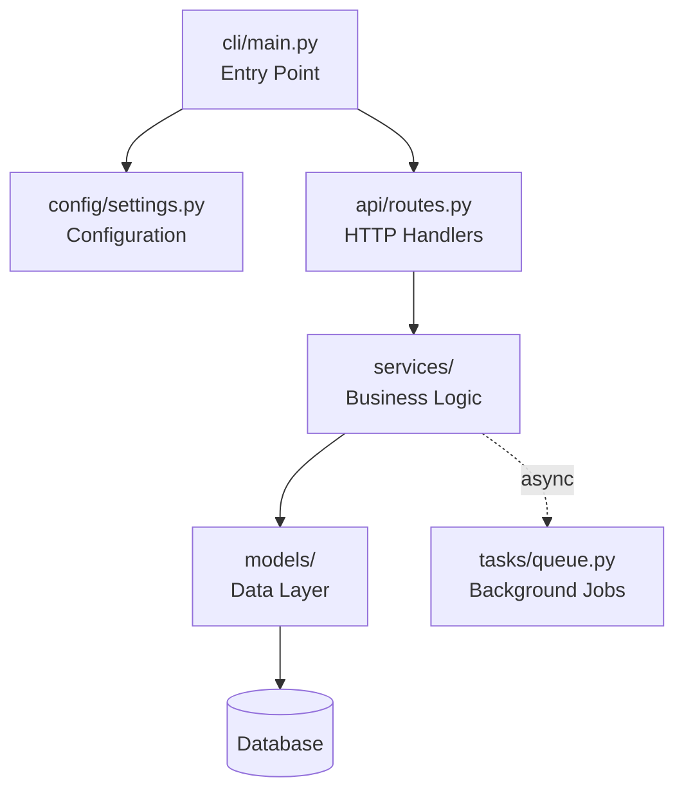
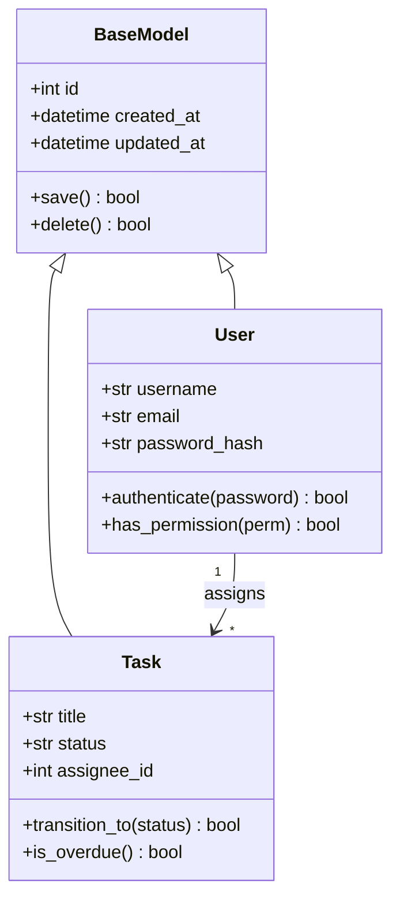
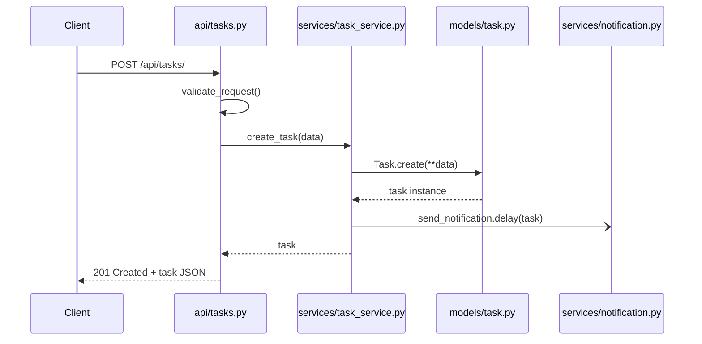

# Developer Documentation Track

This guide is read by the documenting-projects skill after Phase 2 (DEEP-READ) when the documentation target is **Developer Docs**. All content here assumes you have already scanned and read the codebase.

## What Developer Docs Cover

Developer documentation helps someone who will **read, modify, or extend** the code. Focus on:

- Architecture decisions and their rationale (WHY)
- Module structure and dependency relationships
- Data flow through key operations
- Class/struct relationships and hierarchies
- Environment and configuration with impact analysis
- Error handling patterns

## Always Include (for any project)

1. **Project Overview** (2-3 sentences, not a feature list)
2. **Quick Start** (verified commands only)
3. **Architecture Decision Records** (WHY, not just WHAT)
4. **Module Dependency Map** (who calls whom)
5. **Environment & Config** (with required/optional/default/impact)
6. **Error Handling** (exception hierarchy, recovery patterns)

## Mermaid Diagrams

Use Mermaid diagrams to visualize project structure. When generating diagrams, use the Mermaid Chart MCP tool (`mcp__claude_ai_Mermaid_Chart__validate_and_render_mermaid_diagram`) to validate and render them.

### Program Structure Diagram (flowchart)

Use `flowchart` to show module/package relationships and data flow between components.

**When to use:** Showing how modules connect, request processing pipelines, build/deploy flows.



**Guidelines:**
- Label nodes with `filename` + brief role
- Use solid arrows (`-->`) for synchronous calls, dashed arrows (`-.->`) for async
- Group related modules with subgraphs when there are 8+ nodes
- Keep to 2 levels of nesting maximum

### Class / Struct Diagram (classDiagram)

Use `classDiagram` to show class hierarchies, field definitions, and relationships.

**When to use:** OOP codebases with inheritance, composition, or interface patterns.



**Guidelines:**
- Only include classes/structs you have actually read in source code
- Show fields with types as they appear in the code
- Show key methods (public API only, skip internal helpers)
- Use relationship arrows: `<|--` inheritance, `-->` association, `*--` composition, `o--` aggregation
- Add cardinality (`"1"`, `"*"`) when relationships are clear from code

### Sequence Diagram (sequenceDiagram)

Use `sequenceDiagram` to show runtime interactions for key operations.

**When to use:** Request/response flows, multi-step processes, async workflows.



**Guidelines:**
- Name participants with `module_name` for traceability
- Use `-->>` for returns, `->>` for calls, `-)` for async fire-and-forget
- Document the happy path first; add alt/opt blocks only for critical branches
- Reference actual function names from the code

### Rendering Diagrams

When including Mermaid diagrams in documentation, do both:
1. Include the raw Mermaid code block in the markdown (for GitHub/GitLab rendering)
2. Use `mcp__claude_ai_Mermaid_Chart__validate_and_render_mermaid_diagram` to validate syntax before finalizing

## Architecture WHY Documentation

Document decisions, not just structure.

```markdown
## BAD — states the obvious
> The project uses a service layer pattern with services in `app/services/`.

## GOOD — explains the decision
> Business logic is isolated in service classes (`app/services/`) rather than
> in route handlers. This separation allows task_service.py to be called from
> both the REST API and Celery background jobs without duplicating validation
> and notification logic. See `task_service.transition_task()` which is called
> from both `api/tasks.py:POST /:id/transition` and
> `services/scheduler.py:check_overdue_tasks`.
```

**Pattern:** State the choice → Explain the benefit → Point to concrete evidence in code.

## Code References

Always use file:line format for traceability.

```markdown
## BAD — no traceable reference
> Tasks have a status workflow with valid transitions.

## GOOD — traceable to source
> Task status transitions are validated in `app/models/task.py:45-52`
> via the `VALID_TRANSITIONS` dict. The `transition_to()` method (line 67)
> raises ValueError for invalid transitions.
```

## Data Flow Documentation

Show the chain of calls for key operations.

```markdown
## Data Flow: Task Creation
1. `POST /api/tasks/` → `api/tasks.py:create_task()` (line 23)
2. Validates input → `utils/validators.py:validate_task()` (line 15)
3. Business logic → `services/task_service.py:create_task()` (line 12)
4. Persists to DB → `models/task.py:Task` (line 30)
5. Async notification → `services/notification.py:send_task_notification.delay()` (line 45)
```

## Dependency Map

Show module relationships as a tree.

```markdown
## Module Dependencies
api/tasks.py
  → services/task_service.py
    → models/task.py
    → services/notification.py (async, non-blocking)
  → utils/validators.py
  → middleware/auth_middleware.py (decorator)
```

For complex projects, prefer a Mermaid flowchart over text trees.

## Environment Variable Documentation

```markdown
| Variable | Required | Default | Description | Impact of Change |
|----------|----------|---------|-------------|-----------------|
| DATABASE_URL | Yes | - | PostgreSQL connection string | App won't start without it |
| CACHE_TTL | No | 3600 | Redis cache lifetime (seconds) | Lower = fresher data, more DB load |
| MAX_WORKERS | No | 4 | Parallel processing threads | Higher = faster but more memory |
```

**Never just list variables.** Always explain: required?, default?, what happens if you change it?

Source these from actual `.env.example`, config files, or `os.getenv()` / `std::env` calls in the code.
